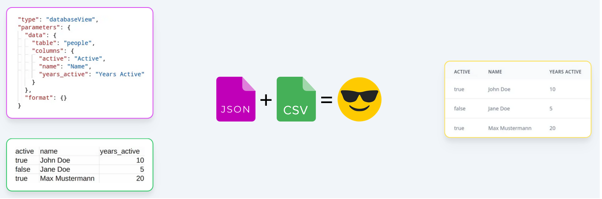

# KAROTTE

Configuration-based applications for the representation of online tables for teams and enterprises



## Demo

The production instance is hosted [here](https://karotte.vercel.app/)

## Run Locally

Clone the project

```bash
  git clone https://github.com/cyamn/web-app-generator
```

Go to the project directory

```bash
  cd web-app-generator
```

To bootstrap the project run it on localhost:3000

```bash
  npm run bootstrap
```

- copy an example .env file
- install dependencies
- build the next.js app
- start the database and the app in production mode

Note: that this will use default passwords and default options

Note: you should be able to use any username and password combination for the generator. It should be usefull to remember it tho :)

Note: docs don't exist yet, sorry.

## Authors

- [@cyamn](https://github.com/cyamn)
